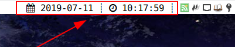

# i3bra

Another i3bar status line tool, implemented by Shell.

## Feature

+ Highly configurable
+ Make module writing easier
+ ...

## How to use

1. ``git clone --depth=1 https://github.com/aj-ash/i3bra && cd i3bra``
2. Copy the config file to the folder you want (Config file template in ``template/config.template``
3. Link ``i3bra`` to ``PATH`` using a **soft link**
4. Add ``status_command i3bra -c path_of_config_file`` to ``i3wm`` config file

## How to write a module

[There](template/module.template)
is a module template for reference.

## Shortcoming

No perfect app in the world.

+ Limited by Shell, speed is not very fast
+ The above shortcomings will lead to inaccurate refresh time

## License

[MIT](LICENSE)

## TODO

+ Optimize this shell script
+ Provide more modules
+ Implement more features based on the i3bar protocol
